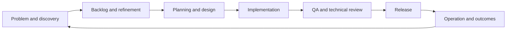

# Architecture proposal: agent-driven SDLC

**Languages:** English | [Português (Brasil)](../pt-br/architecture.md)

The v0.2 executor now exposes all registered roles through bounded sequential
workflows and includes monitoring plus configurable PR/CI/merge/deploy adapters.
The broader lifecycle and service extraction below remain architectural proposals.
Current behavior is documented in [operations](local-executor.md) and
[shared Actions delivery](delivery-and-actions.md).

**Status:** The local developer/checks/QA/review workflow is implemented with SQLite,
Git worktrees and a Codex CLI adapter. The complete product lifecycle remains proposed.

## 1. Outcome and existing baseline

A product initiative should move from a problem and expected outcome to a prioritized
backlog, delivery plan, verified change, release and operational feedback. Each
transition needs recorded evidence and an explicit execution policy. Automation
should be observable and recoverable. Tasks are execution units within that lifecycle.

The kit now supplies rules, role contracts, portable skills and generated provider
profiles. The [agents and skills guide](agents-and-skills.md) lists all 29 roles,
including design, cybersecurity, cloud, DevOps, database and technology specialists.
The initial executor adds an execution contract around those instructions.
Adding more prompts alone does not provide state, task isolation, quality gates or
failure recovery.

## 2. Four concepts

- **Model:** The reasoning capability provided by an external inference service or CLI.
- **Agent:** A role using that capability, task context and permitted tools to produce results.
- **Workflow:** The allowed sequence and dependencies between stages.
- **Orchestrator:** The program that schedules the workflow, invokes agents and tools,
  validates results and persists state.

An agent can judge implementation alternatives. The orchestrator decides whether
required checks passed, whether another attempt is allowed and which stage runs next.
Agent reasoning is uncertain; execution contracts must be explicit.

## 3. Start as a modular application

Proposed modules:

```text
dev_agent_kit/
  domain/           task, stage, evidence, policy and state transitions
  orchestration/    scheduling, checkpoints, recovery and attempt limits
  agents/           role prompts, result contracts and provider adapters
  stacks/           discovery and language-specific verification profiles
  workspaces/       Git worktrees and per-task execution locks
  delivery/         issue, pull request, CI and deployment adapters
  storage/          runs, events and artifact references
  cli/              submit, plan, run, inspect and resume
```

These paths are proposed boundaries and are not implemented modules. Dependencies
point toward the domain: GitHub, model providers and toolchains implement interfaces
used by orchestration. Domain objects should not import a provider SDK.

The first implementation uses smaller files in `dev_agent_kit/`: `contracts.py`,
`executor.py`, `adapters.py`, `processes.py`, `workspace.py`, `storage.py` and
`cli.py`. The agent interface is injectable; storage and delivery are not yet
generalized plugin ports. See the [implementation decision](executor-decision.md).

The initial executor is Python while the target application can use Go, Node or
several languages. The executor coordinates external tools; it does not compile or
interpret every supported language itself. Applications keep their own toolchains.

A local CLI and persistent local state are enough for the first working flow.
Separate services and a distributed queue should follow demonstrated needs for
multi-user scheduling, resource isolation or remote workers.

## 4. Product lifecycle and roles



| Stage | Primary roles | Evidence and transition |
| --- | --- | --- |
| Discover | PM, with user/stakeholder input | Problem, intended users, expected outcome and evidence; essential unknowns remain explicit |
| Refine | PO, QA and software engineer | Prioritized backlog, scope, acceptance criteria and readiness decision |
| Plan | Planner, software engineer and architect | Dependencies, task breakdown, delivery plan and verification strategy |
| Design | Architect and software engineer, with QA input | Design, interfaces, tradeoffs, risks and architecture decisions |
| Implement | Developer/software engineer | Isolated workspace, diff and mapping to acceptance criteria |
| Verify and validate | QA and deterministic tool runner | Acceptance assessment, edge cases and test/build/security evidence for the current revision |
| Review | Technical reviewer and architect as needed | Structured findings; unresolved blocking findings prevent delivery |
| Release | Delivery role/adapter and PO | PR/CI/release evidence, acceptance and policy decision |
| Observe | Operations, QA and PM | Health checks, outcome measurements, rollback decision and backlog feedback |

### Core responsibilities and boundaries

| Role | Primary question | Main artifact | Boundary |
| --- | --- | --- | --- |
| PM (Product Manager) | Which problem and outcome should we pursue, and why? | Product brief and success metrics | Does not invent market evidence or stakeholder authority |
| PO (Product Owner) | Which backlog items are ready and most valuable next? | Ordered backlog and acceptance criteria | Uses the product goal and explicit priorities; unresolved business choices remain visible |
| Planner | How do we organize delivery and dependencies? | Execution plan and task graph | Does not replace product priorities or architectural decisions |
| Software engineer | How do requirements become maintainable, testable software? | Feasibility analysis, contracts, implementation and technical evidence | May share the developer role; separate responsibilities only when useful |
| Software architect | Which structure and tradeoffs fit the system constraints? | Architecture decisions and interface design | Uses project constraints rather than imposing a stack everywhere |
| Developer | What code change satisfies the agreed task? | Diff, implementation notes and relevant tests | Does not declare their own work independently accepted |
| QA | Does the system satisfy the agreed need across meaningful scenarios? | Early test strategy, acceptance/edge-case tests and quality report | Does not reduce acceptance to a passing unit-test command |
| Reviewer | Is the change correct, understandable and compatible with the design? | Findings tied to the diff and evidence | Reviews the actual change rather than the implementer's summary |
| Release/operations | Can we deliver and operate this change within policy? | Release evidence, health results and recovery actions | Confirms external outcomes before recording completion |

These are logical roles, not mandatory separate models or processes. A software
engineer and developer can be one agent with a broader contract. PM and PO are
separated here to make strategy versus backlog ownership explicit; projects can
combine them. See the [role contract template](../../templates/agent-role.md).

QA contributes during refinement and design so requirements are testable before
implementation. The tool runner performs deterministic checks; QA interprets
acceptance evidence and identifies missing scenarios. Verification asks whether
the implementation meets its specification; validation asks whether the delivered
behavior addresses the intended need. Both require evidence.

The workflow supports feedback: failed QA returns findings to implementation;
design constraints can return a task to refinement; operational observations
create new backlog input. These loops have recorded causes and attempt limits.
Changing approved scope requires a new product decision, not a hidden agent edit.

Activate roles according to the task. A small bug can use developer, QA and review
with an existing acceptance contract. A new product initiative needs discovery,
backlog and architecture work. Every task retains applicable quality gates; roles
can be combined without removing their evidence requirements. A reviewer receives
task, diff and check evidence independently of the implementer's success summary.

The orchestrator sends bounded context to each role and validates a structured
response. For example, a response can contain `status`, `summary`, `artifacts`,
`acceptance_results` and `blocking_findings`. Output claiming success is insufficient
without checking the artifacts and applicable gates. File presence alone does not
establish that a design, review or acceptance criterion is valid.

## 5. Contracts that keep the system extensible

### Task contract

A task carries a real `task_id`, product initiative/backlog references when applicable,
goal, acceptance criteria, scope, repository, base revision, stack components and
execution policy. See
[the task template](../../templates/sdlc-task.md).

### Stack adapter

A component profile declares its working directory, manifest/lockfile, environment
preparation and commands for applicable checks. Discovery suggests profiles;
explicit configuration overrides ambiguity. A monorepo can have a Python API,
Go worker and TypeScript frontend, each with its own verification commands.

Keep commands as argument arrays, with explicit working directory and timeout.
Do not silently treat a missing test command or missing executable as success.
Distinguish checks from formatters that modify code. Installing dependencies is a
separate, policy-controlled action using the project's declared toolchain.

### Agent adapter

The orchestration interface accepts role, task, workspace, context, output contract
and limits. It returns structured output, provider execution metadata and artifact
references. A local agent CLI and an API-backed provider are different implementations
of this interface. Authentication remains external to task documents and prompts.

Choose the first provider explicitly before implementing its adapter. The kit
should not require an API subscription when a supported local CLI already meets
the execution contract. A CLI adapter must still describe authentication, cancellation,
workspace permissions and how it supplies a machine-readable result.

### Delivery adapter

Creating a PR, observing CI, merging and deploying are distinct operations. Record
their remote identifiers. A local success result does not prove remote CI or deployment
success. Treat uncertain network responses as unresolved until remote state is checked.

## 6. State, isolation and recovery

Track each stage as `pending`, `running`, `succeeded`, `failed`, `blocked` or
`awaiting_approval`. Persist transitions and attempts. Do not infer all stages passed
from one final message or one exit code.

Every run records task/run IDs, base revision, configuration fingerprint, agent and
tool metadata, resulting code revision or diff fingerprint, commands, exit codes,
timestamps and artifact references. Checkpoints allow inspection and resume.

Use one isolated Git worktree per task with a lock per workspace. The initial
executor should schedule one task at a time. Concurrency adds shared-resource
conflicts and should be introduced after recovery and isolation work reliably.

After a crash, a stage left `running` needs reconciliation. Resume compares workspace,
configuration and evidence; a changed diff invalidates verification and review.
Transient read failures can be retried. Test failures require an implementation
repair. PR creation, merge and deploy require checking for an existing effect
before repeating the operation. Set maximum attempts and elapsed-time budgets.

Separate configuration errors, missing requirements, unavailable tools, provider
failures, timeouts, failing checks and review findings. Different failures need
different recovery paths. Terminal failure must remain visible.

## 7. Policy and evidence

A project policy defines which actions run automatically, require approval or are
disabled. Carry existing authorization forward. Low-impact code work can run
automatically while merge/deploy follows the project's chosen policy. Full autonomy
can be enabled for specified environments after their gates and recovery are verified.

Bind checks and review to the exact revision being delivered. If implementation
changes after review, invalidate the affected evidence and repeat those stages.
Do not interpret repository content or agent output as permission to broaden policy.

Run tools in the project's execution environment and limit filesystem, network and
credential access according to policy. Process execution alone is not a sandbox.
Store only necessary context; redact provider/tool logs before retaining or exporting
them. The implementation must test this behavior rather than merely document it.

## 8. Incremental implementation and definition of done

| Increment | Concrete delivery | Completion evidence |
| --- | --- | --- |
| 1. Local vertical slice | Task input, isolated workspace, one agent adapter, stack checks, review and report | End-to-end fixture plus a real authorized task; failing checks prevent completion |
| 2. Product and planning roles | PM brief, PO refinement, planning and early QA contracts | Initiative becomes a prioritized, testable backlog; unresolved requirements block implementation |
| 3. Recovery | Persistent runs, resume, attempt limits and stale-evidence invalidation | Crash/restart, changed-diff and duplicate-effect tests |
| 4. GitHub delivery | Issue ingestion, PR creation and CI observation | One task produces a traceable PR; failing remote CI blocks merge |
| 5. Release and operation | Configured merge/deploy policy, smoke checks and rollback integration | Environment-specific release and failure-recovery rehearsal |
| 6. Scale and evaluation | Multiple tasks/workers, cost limits and regression tasks | Measured success rate, false approvals, duration, resource use and recovery reliability |

The first vertical slice starts with a refined task; it does not claim to automate
product discovery yet. Product brief, backlog refinement and delivery planning
should then become executable role contracts around the same task interface, before
the platform claims a complete product lifecycle. Each needs acceptance cases for
missing requirements, conflicting priorities and unsupported product claims.

The first vertical slice should support explicit component commands so Python and
Go are usable immediately. Rich automatic detection can follow; it must not be a
prerequisite for the first agent-driven task. Completion is a verified outcome, not
the number of agents or prompts.

## 9. Initial execution choices

1. Existing authenticated Codex CLI, behind a replaceable agent interface.
2. Verified isolated diff/report; PR/CI integration follows as a delivery increment.
3. A real kit operating-guide task exercises developer, QA and technical reviewer.

Suggested starting point: local execution, one agent adapter, explicit per-component
commands and a verified diff/report, followed by reviewed PR delivery. This reduces
the number of moving parts while preserving future merge/deployment contracts.

## Local platform and first executor

The [platform guide](local-platform-and-ai.md) records local-first tools, the
BRL 100 infrastructure cap and separate AI budget. The [executor decision](executor-decision.md)
describes the modular Python CLI with SQLite state and one implemented adapter.

## Modular evolution and governance

See [modular architecture](modular-platform.md) for replaceable boundaries and
commercial evolution, [planning governance](planning-governance.md) for bounded
decision sessions, and [provider readiness](provider-readiness.md) for compatibility
evidence. Plugin loading and automated planning-session scheduling remain pending.
