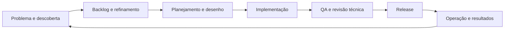

# Proposta de arquitetura: SDLC conduzido por agentes

**Idiomas:** [English](../en/architecture.md) | Português (Brasil)

O executor v0.2 disponibiliza os papéis cadastrados em workflows sequenciais
limitados, com painel e adaptadores configuráveis de PR/CI/merge/deploy. O ciclo
completo e a extração de serviços abaixo continuam propostas arquiteturais.
O comportamento atual está em [operação](local-executor.md) e
[entrega via Actions compartilhado](delivery-and-actions.md).

**Status:** O fluxo local desenvolvedor/checks/QA/revisão está implementado com
SQLite, worktrees Git e adaptador Codex CLI. O ciclo completo de produto segue proposto.

## 1. Resultado e ponto de partida

Uma iniciativa de produto deve sair de um problema e resultado esperado para um
backlog priorizado, plano de entrega, alteração verificada, release e feedback
operacional. Cada transição precisa de evidências e política de execução explícita.
A automação deve ser observável e permitir recuperação. Tarefas são unidades de
execução dentro desse ciclo.

O kit agora fornece regras, contratos de papéis, skills portáveis e perfis gerados
para provedores. O [guia de agentes e skills](agents-and-skills.md) lista os 26 papéis,
incluindo especialistas de design, segurança, cloud, DevOps, banco e tecnologias.
O executor inicial acrescenta um contrato de execução ao redor dessas instruções.
Adicionar prompts, por si só, não resolve estado, isolamento, critérios de passagem
ou recuperação.

## 2. Quatro conceitos

- **Modelo:** Capacidade de raciocínio fornecida por um serviço externo ou CLI.
- **Agente:** Papel que usa essa capacidade, contexto da tarefa e ferramentas permitidas para produzir resultados.
- **Workflow:** Sequência permitida e dependências entre etapas.
- **Orquestrador:** Programa que agenda o workflow, chama agentes e ferramentas, valida resultados e persiste o estado.

Um agente pode avaliar alternativas de implementação. O orquestrador decide se
as verificações obrigatórias passaram, se cabe outra tentativa e qual etapa vem
depois. O raciocínio do agente tem incerteza; contratos de execução precisam ser explícitos.

## 3. Começar como uma aplicação modular

Módulos propostos:

```text
dev_agent_kit/
  domain/           tarefas, etapas, evidências, políticas e transições
  orchestration/    agendamento, checkpoints, recuperação e limites
  agents/           prompts de papéis, contratos de resultado e provedores
  stacks/           descoberta e perfis de verificação por linguagem
  workspaces/       worktrees Git e bloqueios por tarefa
  delivery/         adaptadores de issues, PRs, CI e deploy
  storage/          execuções, eventos e referências a artefatos
  cli/              entrada para submeter, planejar, executar, inspecionar e retomar
```

Esses caminhos representam fronteiras propostas, não módulos implementados.
As dependências apontam para o domínio: GitHub, provedores e ferramentas implementam
interfaces usadas pela orquestração. Objetos do domínio não devem importar o SDK
de um provedor.

A implementação inicial usa arquivos menores em `dev_agent_kit/`: `contracts.py`,
`executor.py`, `adapters.py`, `processes.py`, `workspace.py`, `storage.py` e `cli.py`.
A interface de agente aceita implementações injetadas; armazenamento e entrega
ainda não são portas generalizadas de plugins. Veja a [decisão de implementação](executor-decision.md).

O executor inicial é Python, enquanto a aplicação pode usar Go, Node ou várias
linguagens. Ele coordena ferramentas externas; não precisa compilar ou interpretar
sozinho todas as linguagens. Cada aplicação mantém suas próprias ferramentas.

Uma CLI local e estado local persistente bastam para o primeiro fluxo funcional.
Serviços separados e fila distribuída devem surgir de necessidades demonstradas
de múltiplos usuários, isolamento de recursos ou workers remotos.

## 4. Ciclo de produto e papéis



| Etapa | Papéis principais | Evidência e transição |
| --- | --- | --- |
| Descobrir | PM, com informações do usuário/stakeholders | Problema, usuários, resultado esperado e evidências; lacunas essenciais ficam explícitas |
| Refinar | PO, QA e engenheiro de software | Backlog priorizado, escopo, critérios de aceite e decisão de prontidão |
| Planejar | Planejador, engenheiro e arquiteto | Dependências, divisão de tarefas, plano de entrega e estratégia de verificação |
| Desenhar | Arquiteto e engenheiro, com QA | Desenho, interfaces, alternativas, riscos e decisões de arquitetura |
| Implementar | Desenvolvedor/engenheiro | Workspace isolado, diff e relação com os critérios de aceite |
| Verificar e validar | QA e executor determinístico | Avaliação de aceite, casos de borda e evidências de testes/build/segurança para a revisão atual |
| Revisar | Revisor técnico e arquiteto quando necessário | Achados estruturados; problemas bloqueantes impedem a entrega |
| Entregar | Papel/adaptador de entrega e PO | Evidências de PR/CI/release, aceite e decisão conforme política |
| Observar | Operações, QA e PM | Saúde, métricas de resultado, decisão de rollback e feedback para o backlog |

### Responsabilidades centrais e limites

| Papel | Pergunta principal | Artefato principal | Limite |
| --- | --- | --- | --- |
| PM (Product Manager) | Qual problema e resultado perseguir, e por quê? | Visão de produto e métricas de sucesso | Não inventa evidências de mercado ou autoridade dos stakeholders |
| PO (Product Owner) | Quais itens estão prontos e têm mais valor agora? | Backlog ordenado e critérios de aceite | Usa objetivo e prioridades explícitos; decisões de negócio pendentes permanecem visíveis |
| Planejador | Como organizar a entrega e suas dependências? | Plano de execução e grafo de tarefas | Não substitui prioridades de produto ou decisões de arquitetura |
| Engenheiro de software | Como transformar requisitos em software testável e sustentável? | Viabilidade, contratos, implementação e evidências técnicas | Pode compartilhar o papel do desenvolvedor; separar só quando ajudar |
| Arquiteto de software | Qual estrutura e quais compromissos atendem às restrições do sistema? | Decisões de arquitetura e interfaces | Usa restrições do projeto, sem impor a mesma stack a todos |
| Desenvolvedor | Qual alteração atende à tarefa acordada? | Diff, notas de implementação e testes pertinentes | Não declara seu próprio trabalho aceito de forma independente |
| QA | O sistema atende à necessidade acordada nos cenários relevantes? | Estratégia antecipada, testes de aceite/casos de borda e relatório de qualidade | Não reduz aceite a um comando de teste unitário aprovado |
| Revisor | A alteração é correta, compreensível e compatível com o desenho? | Achados vinculados ao diff e às evidências | Examina a alteração real, sem depender do resumo do implementador |
| Entrega/operações | Podemos entregar e operar esta alteração conforme política? | Evidências de release, saúde e ações de recuperação | Confirma resultados externos antes de registrar conclusão |

São papéis lógicos, sem exigir modelos ou processos separados. Engenheiro de
software e desenvolvedor podem ser um agente com contrato mais amplo. PM e PO
estão separados aqui para distinguir estratégia e gestão de backlog; o projeto
pode combiná-los. Consulte o [template de papel](../../templates/agent-role.md).

QA participa do refinamento e desenho para tornar requisitos testáveis antes
da implementação. O executor realiza verificações determinísticas; QA interpreta
evidências de aceite e identifica cenários ausentes. Verificação pergunta se a
implementação atende à especificação; validação pergunta se o comportamento
entregue atende à necessidade pretendida. As duas exigem evidências.

O workflow admite retornos: reprovação de QA devolve achados à implementação;
restrições de desenho podem devolver a tarefa ao refinamento; observações de
operação alimentam o backlog. Esses ciclos registram causas e limites de tentativas.
Alterar escopo acordado exige nova decisão de produto, não edição oculta de um agente.

Ative os papéis conforme a tarefa. Um bug pequeno pode usar desenvolvimento,
QA e revisão com um contrato de aceite existente. Uma iniciativa nova exige
descoberta, backlog e arquitetura. Toda tarefa preserva os critérios de qualidade
aplicáveis; combinar papéis não elimina evidências. O revisor recebe tarefa, diff
e verificações independentemente do resumo de sucesso do implementador.

O orquestrador envia contexto limitado a cada papel e valida resposta estruturada.
Uma resposta pode conter `status`, `summary`, `artifacts`, `acceptance_results`
e `blocking_findings`. Declarar sucesso não basta sem conferir artefatos e critérios
aplicáveis. A presença de um arquivo, sozinha, não valida seu desenho, revisão ou aceite.

## 5. Contratos que permitem evolução

### Contrato de tarefa

Cada tarefa contém `task_id` real, referências à iniciativa/backlog quando aplicáveis,
objetivo, critérios de aceite, escopo, repositório, revisão base, componentes e
política de execução. Consulte o
[template de tarefa](../../templates/sdlc-task.md).

### Adaptador de stack

O perfil de um componente declara diretório de trabalho, manifest/lockfile,
preparação de ambiente e comandos das verificações aplicáveis. A descoberta sugere
perfis; configuração explícita resolve ambiguidades. Um monorepo pode ter API
Python, worker Go e frontend TypeScript, com comandos próprios para cada um.

Defina comandos como listas de argumentos, com diretório e timeout explícitos.
Ferramenta ou comando de teste ausente não significa sucesso. Separe verificações
de formatadores que alteram arquivos. Instalar dependências é uma ação própria,
controlada pela política e pelas ferramentas declaradas pelo projeto.

### Adaptador de agente

A interface recebe papel, tarefa, workspace, contexto, contrato de saída e limites.
Retorna resultado estruturado, metadados de execução e referências a artefatos.
Uma CLI local de agente e um provedor via API são implementações distintas dessa
interface. Autenticação fica fora dos documentos de tarefas e prompts.

Escolha o primeiro provedor explicitamente antes de implementar o adaptador. O kit
não deve exigir assinatura de API se uma CLI suportada já atende ao contrato.
Mesmo uma integração por CLI precisa definir autenticação, cancelamento,
permissões do workspace e obtenção de resultado legível por máquina.

### Adaptador de entrega

Criar PR, observar CI, fazer merge e publicar são operações diferentes. Registre
os identificadores remotos. Sucesso local não comprova CI ou deploy remoto.
Respostas de rede ambíguas ficam pendentes até conferir o estado remoto.

## 6. Estado, isolamento e recuperação

Cada etapa tem estado `pending`, `running`, `succeeded`, `failed`, `blocked` ou
`awaiting_approval`. Persista transições e tentativas. Uma mensagem final ou um
código de saída não comprova que todas as etapas passaram.

A execução registra IDs da tarefa/execução, revisão base, impressão da configuração,
metadados de agentes e ferramentas, revisão produzida ou impressão do diff,
comandos, códigos de saída, horários e referências a artefatos. Checkpoints
permitem inspecionar e retomar o trabalho.

Use um worktree Git isolado por tarefa, com bloqueio por workspace. O executor
inicial deve agendar uma tarefa por vez. Concorrência traz conflitos de recursos
compartilhados e deve entrar depois que isolamento e recuperação funcionarem.

Após um crash, uma etapa deixada em `running` exige reconciliação. A retomada compara
workspace, configuração e evidências; um diff alterado invalida verificação e revisão.
Falhas transitórias de leitura podem ser repetidas. Testes falhando exigem reparo
na implementação. Criar PR, fazer merge e deploy exige conferir se o efeito já
ocorreu antes de repetir. Defina limites de tentativas e tempo total.

Distinga erros de configuração, requisitos ausentes, ferramentas indisponíveis,
falhas de provedor, timeout, verificações reprovadas e achados de revisão.
Cada categoria exige recuperação diferente. Uma falha terminal deve continuar visível.

## 7. Política e evidências

A política do projeto define ações automáticas, sujeitas a aprovação ou desativadas.
Preserve autorizações já concedidas. Alterações de código de baixo impacto podem
rodar automaticamente, enquanto merge/deploy segue a política escolhida. Autonomia
completa pode ser habilitada para ambientes específicos após validar seus critérios
de passagem e recuperação.

Vincule verificações e revisão à exata revisão entregue. Alterar a implementação
depois da revisão invalida as evidências afetadas e exige repetir essas etapas.
Conteúdo do repositório ou saída de agente não autoriza ampliar a política.

Execute ferramentas no ambiente do projeto e limite acesso a arquivos, rede e
credenciais conforme política. Executar um processo, por si só, não cria sandbox.
Guarde apenas contexto necessário; remova segredos dos logs antes de armazenar
ou exportar. A implementação precisa testar esse comportamento.

## 8. Implementação incremental e critérios de conclusão

| Incremento | Entrega concreta | Evidência de conclusão |
| --- | --- | --- |
| 1. Fluxo local completo | Entrada de tarefa, workspace isolado, um adaptador de agente, verificações, revisão e relatório | Cenário ponta a ponta controlado e tarefa real autorizada; falhas impedem conclusão |
| 2. Papéis de produto e planejamento | Contratos de visão do PM, refinamento do PO, planejamento e QA antecipado | Iniciativa vira backlog priorizado e testável; requisitos pendentes bloqueiam implementação |
| 3. Recuperação | Execuções persistentes, retomada, limites e invalidação de evidências antigas | Testes de crash/reinício, diff alterado e efeitos duplicados |
| 4. Entrega no GitHub | Entrada por issue, criação de PR e acompanhamento de CI | Tarefa produz PR rastreável; CI remoto reprovado bloqueia merge |
| 5. Release e operação | Política de merge/deploy, smoke checks e rollback | Ensaio de release e recuperação por ambiente |
| 6. Escala e avaliação | Múltiplas tarefas/workers, limites de custo e tarefas de regressão | Taxa de sucesso, aprovações incorretas, duração, recursos e confiabilidade da recuperação medidos |

O primeiro fluxo começa com uma tarefa refinada; ele ainda não representa descoberta
de produto automatizada. Visão de produto, refinamento de backlog e planejamento
devem então virar contratos de papéis executáveis sobre a mesma interface de tarefa,
antes de declarar o ciclo de produto completo. Cada um exige cenários de aceite
para requisitos ausentes, prioridades conflitantes e alegações sem evidências.

O primeiro fluxo deve aceitar comandos explícitos por componente para usar Python
e Go desde o início. Detecção automática mais rica pode vir depois; ela não deve
ser requisito para a primeira tarefa conduzida por agentes. Conclusão significa
resultado verificado, não quantidade de agentes ou prompts.

## 9. Escolhas da execução inicial

1. Codex CLI com autenticação existente, atrás de uma interface substituível de agente.
2. Diff/relatório isolado e verificado; integração PR/CI será um incremento de entrega.
3. Uma tarefa real de guia operacional do kit exercita desenvolvedor, QA e revisor técnico.

Ponto de partida sugerido: execução local, um adaptador de agente, comandos
explícitos por componente e diff/relatório verificado, seguido de entrega por PR
revisado. Isso reduz as peças envolvidas e preserva os contratos de merge/deploy.

## Plataforma local e primeiro executor

O [guia de plataforma](local-platform-and-ai.md) registra ferramentas locais, o teto
de R$ 100 para infraestrutura e IA com orçamento separado. A [decisão do executor](executor-decision.md)
descreve a CLI Python modular, estado SQLite e um adaptador implementado.

## Evolução modular e governança

Consulte [arquitetura modular](modular-platform.md) para fronteiras substituíveis e
evolução comercial, [planejamento](planning-governance.md) para sessões de decisão
limitadas e [compatibilidade](provider-readiness.md) para evidências dos clientes.
Carregamento de plugins e agendamento automático de sessões seguem pendentes.
